

  <h1 align="center">📊 Automated CSV Data Pipeline</h1>
  

    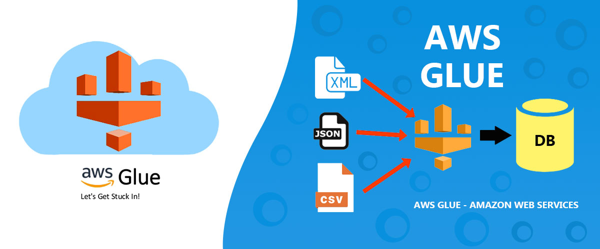
    <strong>Serverless ETL, Data Lake Archiving & Business Intelligence Visualization</strong>
     
    <a href="#about-the-project"><strong>Explore the docs »</strong></a>
  

  
Table of Contents

  <ol>
    <li><a href="#about-the-project">About The Project</a></li>
    <li><a href="#built-with">Built With</a></li>
    <li><a href="#use-cases">Use Cases</a></li>
    <li><a href="#architecture">Architecture</a></li>
    <li><a href="#file-structure">File Structure</a></li>
    <li><a href="#getting-started">Getting Started</a></li>
    <li><a href="#usage">Usage & Testing</a></li>
    <li><a href="#roadmap">Roadmap</a></li>
    <li><a href="#challenges">Challenges</a></li>
    <li><a href="#cost-optimization">Cost Optimization</a></li>
  </ol>

<h2 id="about-the-project">About The Project</h2>

  The <strong>Automated CSV Data Pipeline</strong> is a professional-grade serverless ETL (Extract, Transform, Load) solution designed to handle messy raw data and convert it into high-performance analytical formats. The system automates the lifecycle of a CSV file: from initial upload and Lambda-based cleaning to Spark-powered transformation into <strong>Parquet</strong>, and finally, automated visualization in <strong>Amazon Quick Suite</strong>.

  This project utilizes <strong>Infrastructure as Code (Terraform)</strong> to provision a complex multi-stage pipeline, ensuring that security roles (IAM), compute (Lambda/Glue), and analytics (Quick Suite) are perfectly synced without manual intervention.

  <strong>⚠️ NOTE:</strong> This project is <strong>not entirely within the AWS Free Tier</strong> due to the Amazon Quick Suite Enterprise Edition subscription. Estimated costs are <strong>$0.50 - $1.00 USD</strong> if infrastructure is destroyed immediately after testing.

<a href="#readme-top">↑ Back to Top</a>

<h2 id="built-with">Built With</h2>

  
  
  
  
  
  
  

<ul>
  <li><strong>AWS Lambda:</strong> Event-driven Python function that cleans raw CSV files (removes empty rows) immediately upon upload.</li>
  <li><strong>Terraform:</strong> Manages the entire lifecycle, including specialized Quick Suite account subscriptions and termination protection.</li>
  <li><strong>S3:</strong> Cloud storage for raw, processed, and transformed data.</li>
  <li><strong>AWS Glue:</strong> Serverless ETL service that runs Spark/Python scripts to convert cleaned data into Parquet format for optimized analysis.</li>
  <li><strong>Amazon Quick Suite (QuickSight):</strong> Enterprise-grade BI tool for real-time data analysis.</li>
  
  <li><strong>IAM:</strong> Securely manages permissions for cross-service communication.</li>
</ul>

<a href="#readme-top">↑ Back to Top</a>

<h2 id="use-cases">Use Cases</h2>
<ul>
  <li><strong>Sales Reporting:</strong> Automatically process daily transaction CSVs into a unified dashboard.</li>
  <li><strong>Log Analysis:</strong> Clean and structure messy system logs for long-term archiving in a Data Lake.</li>
  <li><strong>Data Lake Foundation:</strong> Build a scalable architecture that grows from small CSVs to Petabyte-scale Parquet datasets.</li>
</ul>

<a href="#readme-top">↑ Back to Top</a>

<h2 id="architecture">Architecture</h2>
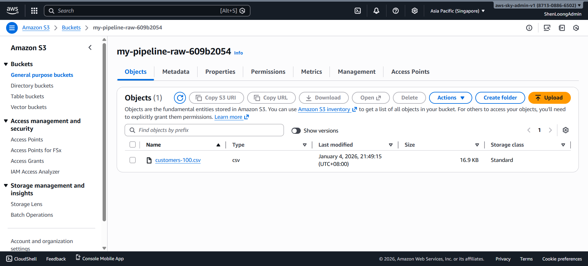 
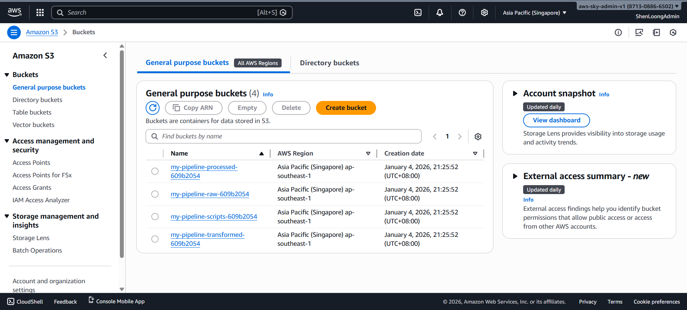
<ol>
  <li><strong>Ingestion:</strong> CSV is uploaded to <code>S3 Raw</code>.</li>
  <li><strong>Pre-Processing:</strong> <strong>Lambda</strong> cleans the data (removes empty rows/nulls) and moves it to <code>S3 Processed</code>.</li>
  <li><strong>ETL Trigger:</strong> Lambda starts the <strong>AWS Glue Job</strong>.</li>
  <li><strong>Transformation:</strong> Glue converts the CSV to <strong>Parquet</strong>, storing it in the <code>S3 Transformed</code> Data Lake.</li>
  <li><strong>Cataloging:</strong> <strong>Glue Crawler</strong> updates the Data Catalog schema.</li>
  <li><strong>Visualization:</strong> <strong>Quick Suite</strong> queries the data via <strong>Athena</strong> for real-time reporting.</li>
</ol>

<a href="#readme-top">↑ Back to Top</a>

<h2 id="file-structure">File Structure</h2>
<pre>CSV-DATA-PIPELINE/
├── scripts/                     # Python logic
│   ├── cleaning_lambda.py       # Pre-processing script for Lambda
│   └── transform_job.py         # PySpark ETL script for Glue
├── glue.tf                      # ETL Jobs, Crawlers, and Catalog Databases
├── iam.tf                       # Scoped policies (Least Privilege)
├── lambda.tf                    # Function config, S3 triggers, and DLQ
├── main.tf                      # Provider settings and global tags
├── quicksight.tf                # BI Subscription and Athena Data Sources
├── s3.tf                        # Data Lake buckets and lifecycle rules
├── variables.tf                 # Configuration (Region, Project Name)
└── outputs.tf                   # Deployment metadata
</pre>

<a href="#readme-top">↑ Back to Top</a>

<h2 id="getting-started">Getting Started</h2>
<h3>Prerequisites</h3>
<ul>
  <li>AWS CLI configured with Admin permissions.</li>
  <li>Terraform CLI installed / Terraform Cloud account registered.</li>
  <li><strong>Set your AWS Region:</strong> Set to whatever <code>aws_region</code> you want in <code>variables.tf</code>.</li>
</ul>

<h3>Terraform State Management</h3>

Select one:

<ol>
   <li>Terraform Cloud</li>
   <li>Terraform Local CLI</li>
</ol>

<h4>Terraform Cloud Configuration</h4>

If you choose Terraform Cloud, please follow the steps below:

<ol>
   <li>Create a new <strong>Workspace</strong> in Terraform Cloud.</li>
   <li>In the Variables tab, add the following <strong>Terraform Variables:</strong>
   </li>
   <li>
    Add the following <strong>Environment Variables</strong> (AWS Credentials):
    <ul>
      <li><code>AWS_ACCESS_KEY_ID</code></li>
      <li><code>AWS_SECRET_ACCESS_KEY</code></li>
   </ul>
   </li>
</ol>

<h4>Terraform Local CLI Configuration</h4>

If you choose Terraform Local CLI, please follow the steps below:

<ol>
   <li>
      Comment the <code>backend</code> block in <code>terraform.tf</code>:
      <pre># backend "remote" {
#   hostname     = "app.terraform.io"
#   organization = "&lt;your-terraform-organization-name&gt;"
#   workspaces {
#     name = "&lt;your-terraform-workspace-name&gt;"
#   }
# }</pre>
   </li>
   <li>
    Add the following <strong>Environment Variables</strong> (AWS Credentials):
    <pre>git bash command:
export AWS_ACCESS_KEY_ID=&lt;your-aws-access-key-id&gt;
export AWS_SECRET_ACCESS_KEY=&lt;your-aws-secret-access-key&gt;
</ol>

<h3>Deployment</h3>
<ol>
  <li>Set your email address to register QuickSight account:
    <pre>Terraform Local: enter git bash command below
export TF_VAR_email=&lt;your-email@example.com&gt;
Terraform Cloud: 
Configure TF_VAR_email environment variables in workspace</pre>
  </li>
  <li>
    <strong>Clone the Repository</strong>
  </li>
  <li>
    <strong>Provision Infrastructure:</strong>
    <ul>
      <li>
        <strong>Terraform Cloud</strong> → <strong>Initialize & Apply:</strong> Push your code to GitHub. Terraform Cloud will automatically detect the change, run a <code>plan</code>, and wait for your approval.
      </li>
      <li>
        <strong>Terraform CLI</strong> → <strong>Initialize & Apply:</strong> Run <code>terraform init</code> → <code>terraform plan</code> → <code>terraform apply</code>, and wait for your approval.
      </li>
    </ul>
  </li>
</ol>

<h3 style="color: #d9534f;">⚠️ Important: Manual Verification (Before Destruction)</h3>

To prevent <code>terraform destroy</code> failures and ensure the infrastructure is fully cleaned up, please perform these manual checks in the AWS Console:

<ul>
  <li>
    <strong>1. Disable Termination Protection:</strong> 
    Even if <code>termination_protection_enabled = false</code> is set in your Terraform code, it is best practice to verify this in the UI. 
     <i>Navigate to:</i> <strong>Quick Suite (QuickSight) > Manage QuickSight > Account Settings</strong>. 
    Ensure the "Termination Protection" toggle is <b>OFF</b>.
  </li>
  <li>
    <strong>2. Verify Custom IAM Role:</strong> 
    To ensure data accessibility, check that the account is using the custom role created by Terraform (<code>quicksight_custom_role</code>).
     <i>Navigate to:</i> <strong>Quick Suite (QuickSight) > Manage QuickSight > Security & Permissions</strong>. 
    Click <b>'Manage'</b> and verify that the S3 buckets are selected and the role matches the ARN defined in your <code>iam.tf</code>. 
    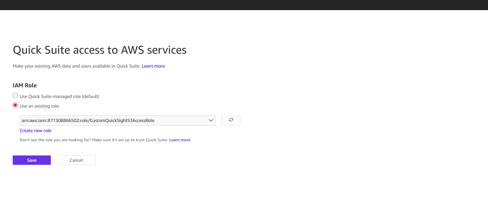
  </li>
</ul>

<a href="#readme-top">↑ Back to Top</a>

<h2 id="usage">Usage & Testing</h2>
<h3>🧪 Testing Steps in AWS Console</h2>

Follow these steps to verify your pipeline is working correctly:

<ol>
  <li>
    <strong>Upload to Raw Bucket:</strong>
    <pre>aws s3 cp &lt;your-csv-file&gt; s3://&lt;your-s3-raw-bucket&gt;</pre>
    
  </li>
  <li>
    <strong>Inspect Lambda Logs:</strong> Go to <strong>CloudWatch > Log Groups</strong> and find <code>/aws/lambda/csv_data_cleaner</code>. Check the latest stream to confirm the file was processed and rows were cleaned. 
    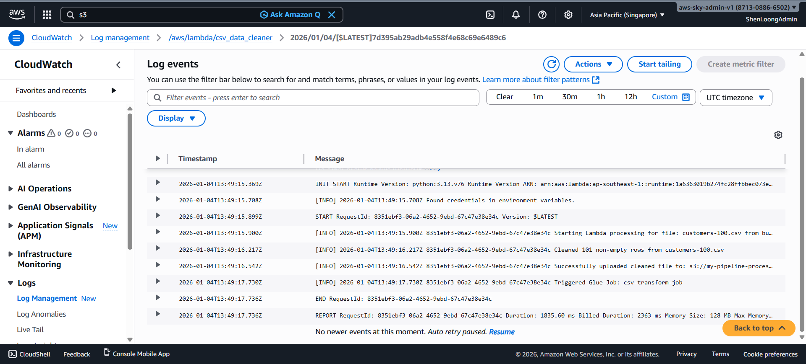
  </li>
  <li>
    <strong>Check ETL Jobs:</strong> Open the <strong>AWS Glue</strong> console. Under ETL jobs, verify that <code>csv-transform-job</code> was automatically triggered by the Lambda function. 
    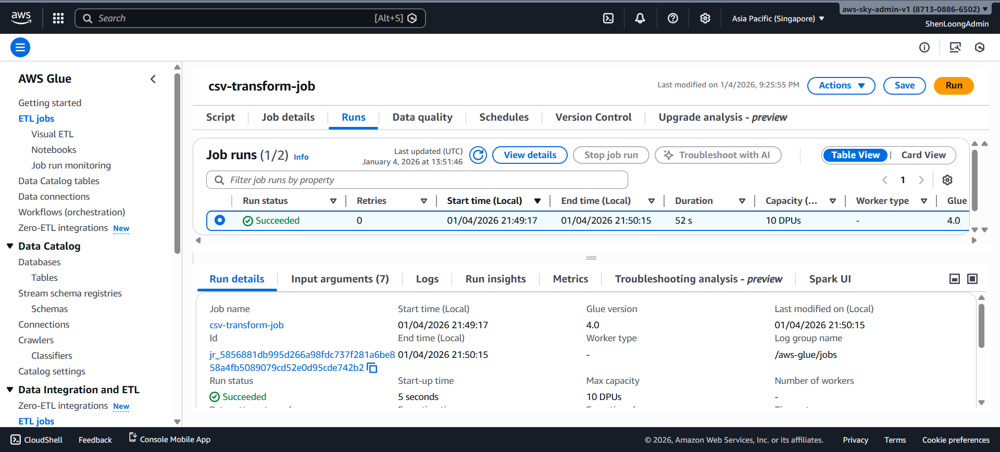
  </li>
  <li>
    <strong>Check Bucket Objects:</strong> 
    <ul>
      <li>Confirm a cleaned version exists in the <code>...processed...</code> bucket.</li>
      <li>
        Confirm a csv file generated in the <code>...transformed...</code> bucket. 
        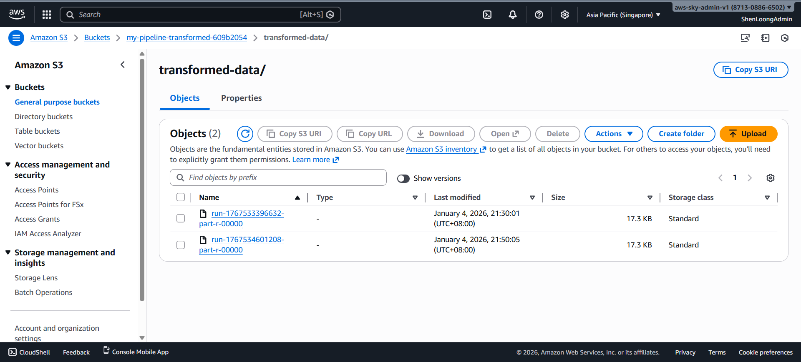
      </li>
    </ul>
  </li>
  <li>
    <strong>Quick Suite Registration:</strong> Open <strong>Amazon QuickSight</strong>. If it's your first time, follow the prompts to sign up for the <strong>Enterprise Edition</strong> and register your notification email. 
    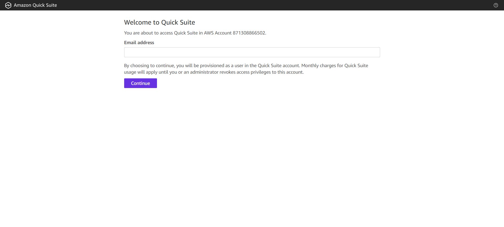
  </li>
  <li>
    <strong>Add Dataset:</strong> 
    <ul>
      <li>Click <strong>Datasets > New dataset > S3</strong>.</li>
      <li>
        Enter a name and the <strong>S3 URI</strong> of your <code>manifest.json</code> file found in the transformed bucket. 
        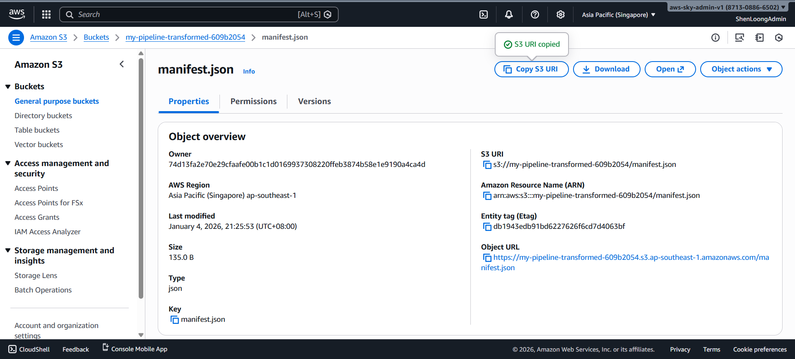 
        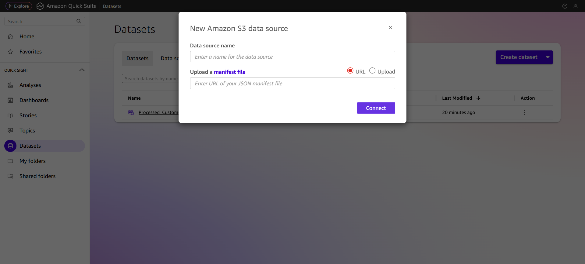
      </li>
    </ul>
  </li>
  <li>
    <strong>Visualize:</strong> Click <strong>Visualize</strong> to create an analysis. Drag fields into the workspace to create charts (e.g., bar charts, pivot tables). 
    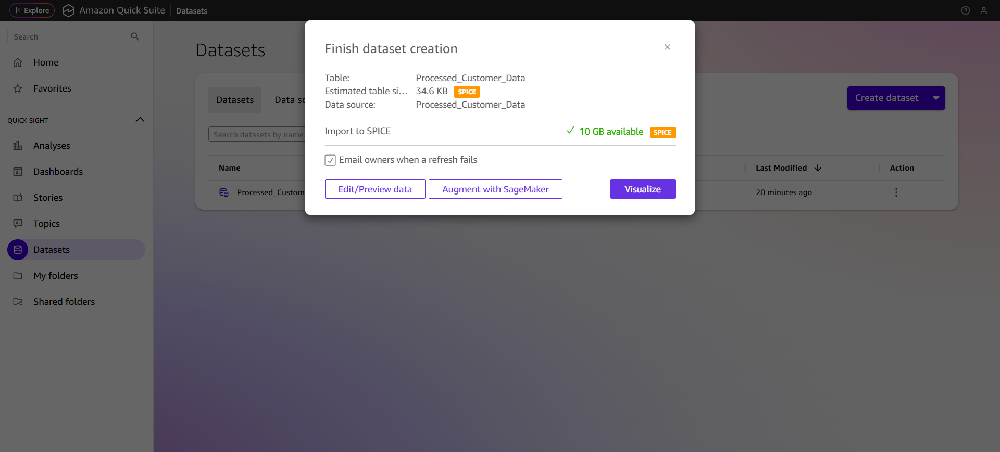
  </li>
  <li>
    <strong>Publish:</strong> Once customized, click <strong>Share > Publish</strong> dashboard to create a read-only version for stakeholders. 
    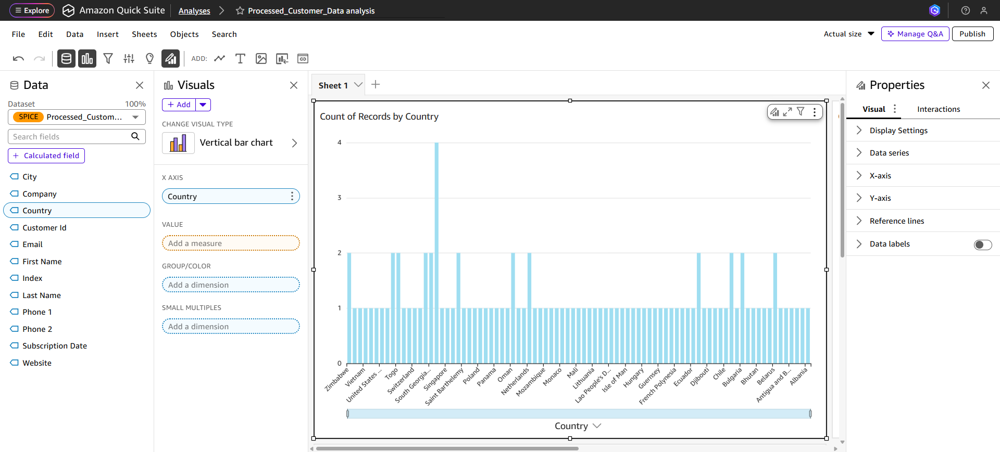 
    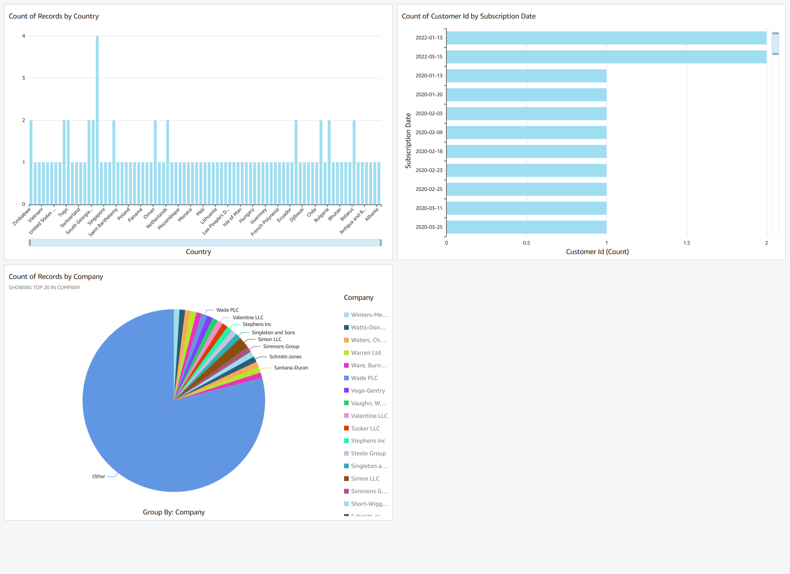
  </li>
  <li>
    <strong>Schedule Refresh (Optional):</strong> In the <strong>Datasets</strong> tab, select your dataset and go to <strong>Refresh</strong>. Click <strong>Add new schedule</strong> to keep your charts updated automatically.
  </li>
</ol>

<a href="#readme-top">↑ Back to Top</a>

<h2 id="roadmap">Roadmap</h2>
<ul>
  <li>[x] <strong>Parquet Migration:</strong> Replaced CSV-only flow with optimized binary storage.</li>
  <li>[x] <strong>IAM Scoping:</strong> Removed wildcards for log groups and S3 paths.</li>
  <li>[x] <strong>Automated Cleaning:</strong> Lambda-based row sanitization.</li>
  <li>[x] <strong>Infrastructure as Code:</strong> Full deployment via Terraform.</li>
  <li>[ ] <strong>Multi-format Support:</strong> Extend the Lambda/Glue logic to handle JSON and Excel files.</li>
  <li>[ ] <strong>Data Validation:</strong> Add Great Expectations or Glue Data Quality to block malformed data from reaching the transformed layer.</li>
  <li>[ ] <strong>Real-time Alerting:</strong> Implement SNS notifications for Glue Job failures.</li>
</ul>

<a href="#readme-top">↑ Back to Top</a>

<h2 id="challenges">Challenges</h2>
<table>
  <thead>
    <tr>
      <th>Challenge</th>
      <th>Solution</th>
    </tr>
  </thead>
  <tbody>
    <tr>
      <td><strong>Glue Log Fragmentation</strong></td>
      <td>Implemented custom Log Groups in Terraform and utilized the Glue Context Logger to centralize <code>stdout</code> and Spark logs.</td>
    </tr>
    <tr>
      <td><strong>Log Visibility</strong></td>
      <td>Mapped standard Python <code>logging</code> and <code>print</code> to specialized CloudWatch Log Groups managed by Terraform.</td>
    </tr>
    <tr>
      <td><strong>Sticky Quick Suite (QuickSight) Deletions</strong></td>
      <td>Managed <code>termination_protection_enabled</code> via Terraform and added explicit <code>depends_on</code> to prevent account deletion locks.</td>
    </tr>
    <tr>
      <td><strong>Permissions</strong></td>
      <td>Implemented Scoped IAM policies (Least Privilege) to ensure Lambda/Glue only access specific buckets.</td>
    </tr>
    <tr>
      <td><strong>Data Format Compatibility</strong></td>
      <td>Switched from S3 Manifests (text-only) to Athena (connector-based) to support high-performance Parquet files in Quick Suite.</td>
    </tr>
  </tbody>
</table>

<a href="#readme-top">↑ Back to Top</a>

<h2 id="cost-optimization">Cost Optimization</h2>
<ul>
  <li>
    <strong>S3 Lifecycle Policies:</strong> S3 lifecycle rules automatically delete transient "Processed" CSVs after 7 days.
    <ul>
      <li><strong>Raw/Processed:</strong> Objects are automatically deleted after 7 days to minimize storage costs for transient data.</li>
      <li><strong>Transformed:</strong> Older versions are expired after 30 days to keep versioning costs low.</li>
    </ul>
  </li>
  <li><strong>Worker Capping:</strong> Glue Jobs are limited to <code>G.1X</code> worker types and 2 workers max.</li>
  <li><strong>Serverless Execution:</strong> You only pay for the seconds your Lambda and Glue jobs run; there are no idle server costs.</li>
  <li><strong>QuickSight SPICE:</strong> Utilizing SPICE (Super-fast, Parallel, In-memory Calculation Engine) allows for fast dashboard performance without hitting S3 for every visual interaction.</li>
  <li><strong>Development Safety:</strong> <code>max_retries = 0</code> ensures failed Spark jobs don't burn credits through automatic restarts.</li>
</ul>

<a href="#readme-top">↑ Back to Top</a>
