

[![Contributors][contributors-shield]][contributors-url]
[![Forks][forks-shield]][forks-url]
[![Stargazers][stars-shield]][stars-url]
[![Issues][issues-shield]][issues-url]
[![Unlicense License][license-shield]][license-url]
[![LinkedIn][linkedin-shield]][linkedin-url]

  <h1>📊 Automated CSV Data Pipeline</h1>
  

    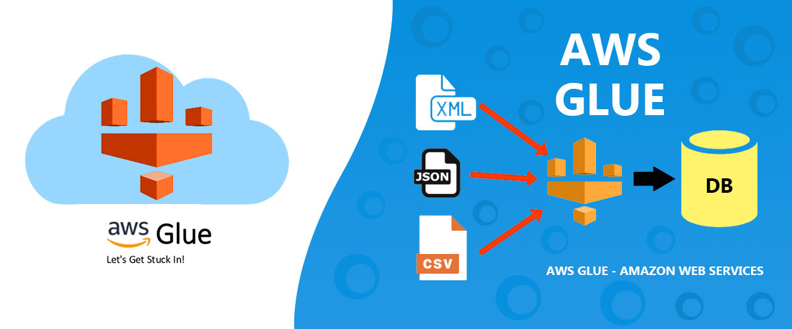 
    <strong>Serverless ETL, Data Lake Archiving & Business Intelligence Visualization</strong>
     
    <a href="#about-the-project"><strong>Explore the docs »</strong></a>
  

 

 
[![Infrastructure CI][ci-shield]][ci-url]
[![Production Deployment][cd-shield]][cd-url]
[![Update Documentation][docs-shield]][docs-url]

 

  
Table of Contents

  <ol>
    <li><a href="#about-the-project">About The Project</a></li>
    <li><a href="#built-with">Built With</a></li>
    <li><a href="#use-cases">Use Cases</a></li>
    <li><a href="#architecture">Architecture</a></li>
    <li><a href="#file-structure">File Structure</a></li>
    <li><a href="#technical">Technical Reference</a></li>
    <li><a href="#getting-started">Getting Started</a></li>
    <li><a href="#gitops">GitOps & CI/CD Workflow</a></li>
    <li><a href="#usage">Usage</a></li>
    <li><a href="#roadmap">Roadmap</a></li>
    <li><a href="#challenges-faced">Challenges</a></li>
    <li><a href="#well-architected">Well Architected Framework</a></li>
    <li><a href="#acknowledgements">Acknowledgements</a></li>
  </ol>

<h2 id="about-the-project">About The Project</h2>

  The <strong>Automated CSV Data Pipeline</strong> is a professional-grade serverless ETL (Extract, Transform, Load) solution designed to handle messy raw data and convert it into high-performance analytical formats. The system automates the lifecycle of a CSV file: from initial upload and Lambda-based cleaning to Spark-powered transformation, and finally, automated visualization in <strong>Amazon Quick Suite</strong>.

  This project utilizes <strong>Infrastructure as Code (Terraform)</strong> to provision a complex multi-stage pipeline, ensuring that security roles (IAM), compute (Lambda/Glue), and analytics (Quick Suite) are perfectly synced without manual intervention.

  <strong>⚠️ NOTE:</strong> This project is <strong>not entirely within the AWS Free Tier</strong> due to the Amazon Quick Suite Enterprise Edition subscription. Estimated costs are <strong>$0.50 - $1.00 USD</strong> if infrastructure is destroyed immediately after testing.

<a href="#readme-top">↑ Back to Top</a>

<h2 id="built-with">Built With</h2>

  
  
  
  
  
  
  

<ul>
  <li><strong>AWS Lambda:</strong> Event-driven Python function that cleans raw CSV files (removes empty rows) immediately upon upload.</li>
  <li><strong>Terraform:</strong> Manages the entire lifecycle, including specialized Quick Suite account subscriptions and termination protection.</li>
  <li><strong>S3:</strong> Cloud storage for raw, processed, and transformed data.</li>
  <li><strong>AWS Glue:</strong> Serverless ETL service that runs Spark/Python scripts to convert cleaned data for optimized analysis.</li>
  <li><strong>Amazon Quick Suite (QuickSight):</strong> Enterprise-grade BI tool for real-time data analysis.</li>

  <li><strong>IAM:</strong> Securely manages permissions for cross-service communication.</li>
</ul>

<a href="#readme-top">↑ Back to Top</a>

<h2 id="use-cases">Use Cases</h2>
<ul>
  <li><strong>Sales Reporting:</strong> Automatically process daily transaction CSVs into a unified dashboard.</li>
  <li><strong>Log Analysis:</strong> Clean and structure messy system logs for long-term archiving in a Data Lake.</li>
  <li><strong>Data Lake Foundation:</strong> Build a scalable architecture that grows from small CSVs to Petabyte-scale datasets.</li>
</ul>

<a href="#readme-top">↑ Back to Top</a>

<h2 id="architecture">Architecture</h2>
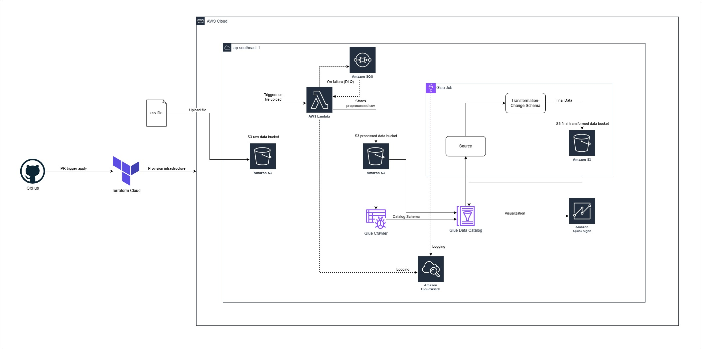
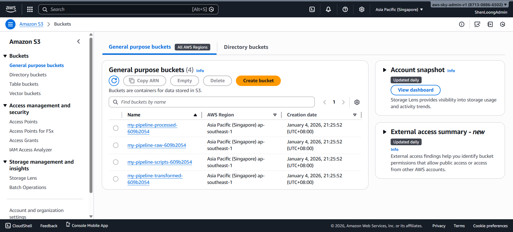
<ol>
  <li><strong>Ingestion:</strong> CSV is uploaded to <code>S3 Raw</code>.</li>
  <li><strong>Pre-Processing:</strong> <strong>Lambda</strong> cleans the data (removes empty rows/nulls) and moves it to <code>S3 Processed</code>.</li>
  <li><strong>ETL Trigger:</strong> Lambda starts the <strong>AWS Glue Job</strong>.</li>
  <li><strong>Transformation:</strong> Glue stores it in the <code>S3 Transformed</code> Data Lake.</li>
  <li><strong>Cataloging:</strong> <strong>Glue Crawler</strong> updates the Data Catalog schema.</li>
  <li><strong>Visualization:</strong> <strong>Quick Suite</strong> queries the data via <strong>Athena</strong> for real-time reporting.</li>
</ol>

<a href="#readme-top">↑ Back to Top</a>

<h2 id="file-structure">File Structure</h2>
<pre>aws-terraform-csv-pipeline/
├── .terraform/                             # Terraform working directory
├── assets/                                 # Project documentation assets (diagrams, images)
├── csv/                                    # Sample CSV data for testing the pipeline
├── modules/                                # Reusable Infrastructure as Code modules
│   ├── glue/                               # AWS Glue ETL Job, Crawler, and Data Catalog config
│   ├── lambda/                             # Python pre-processing logic and Lambda resource
│   │   └── lambda/
│   │       ├── cleaning_lambda.py          # Python script: Row-level cleaning
│   │       └── lambda_function_payload.zip
│   ├── quicksight/                         # QuickSight account settings, data source, and datasets
│   └── storage/                            # Parameterized S3 bucket module (Raw, Processed, Transformed)
│       ├── glue_jobs/
│       │   └── transform_job.py            # PySpark script: Store CSV
│       ├── main.tf                         # S3 buckets, lifecycle policies, and encryption [cite: 8, 9, 11]
│       ├── outputs.tf                      # Exported S3 ARNs and manifest keys
│       ├── providers.tf                    # Version constraints for the storage module
│       └── variables.tf                    # Module inputs (e.g., project_name, bucket_type)
├── .gitignore
├── .terraform.lock.hcl
├── main.tf                                 # Root module: Instantiates storage, glue, lambda, and quicksight modules
├── outputs.tf                              # Root level outputs (e.g., S3 Bucket IDs, QuickSight Manifest URI)
├── providers.tf                            # AWS provider and version constraints
├── variables.tf                            # Configurable global inputs (Region, Tags, Project Name)
├── .pre-commit-config.yaml                 # Orchestrates local git-hooks (e.g., tflint, checkov)
├── .tflint.hcl                             # AWS-specific TFLint ruleset configuration
├── .checkov.yml                            # Infrastructure security scan ignore list
├── .terraform-docs.yml                     # Automation config for generating README documentation
├── terraform.tfstate                       # Current state of deployed infrastructure
├── terraform.tfstate.backup                # Previous state snapshot
├── README.template.md                      # Source template for documentation
└── README.md                               # Final documentation (Auto-generated/Injected)
</pre>

<a href="#readme-top">↑ Back to Top</a>

<h2 id="technical">Technical Reference</h2>
This section is automatically updated with the latest infrastructure details.

<b>Detailed Infrastructure Specifications</b>

<!-- BEGIN_TF_DOCS -->
{{ .Content }}
<!-- END_TF_DOCS -->

<a href="#readme-top">↑ Back to Top</a>

<h2 id="getting-started">Getting Started</h2>
<h3>Prerequisites</h3>
<ul>
  <li>AWS CLI configured with Admin permissions.</li>
  <li>Terraform CLI installed / Terraform Cloud account registered.</li>
  <li><strong>Set your AWS Region:</strong> Set to whatever <code>aws_region</code> you want in <code>variables.tf</code>.</li>
</ul>

<h3>Terraform State Management</h3>

Select one:

<ol>
   <li>Terraform Cloud</li>
   <li>Terraform Local CLI</li>
</ol>

<h3>Terraform Cloud State Management</h3>
<ol>
   <li>Create a new <strong>Workspace</strong> with github version control workflow in Terraform Cloud.</li>
   <li>In the Variables tab, add the following <strong>Terraform Variables:</strong>
   </li>
   <li>
    Add the following <strong>Environment Variables</strong> (AWS Credentials):
    <ul>
      <li><code>AWS_ACCESS_KEY_ID</code></li>
      <li><code>AWS_SECRET_ACCESS_KEY</code></li>
   </ul>
   </li>
    <li>
      Run the command ni Terraform CLI:
      <pre>terraform login</pre>
    </li>
    <li>Create a token and follow the steps in browser to complete the Terraform Cloud Connection.</li>
    <li>
      Add the <code>backend</code> block in <code>terraform</code> code block</code>:
    <pre>backend "remote" {
  hostname     = "app.terraform.io"
  organization = &lt;your-organization-name&gt;
  workspaces {
    name = &lt;your-workspace-name&gt;
  }
}</pre>
   </li>
    <li>
      Run the command in Terraform CLI to migrate the state into Terraform Cloud:
      <pre>terraform init -migrate-state</pre>
    </li>
</ol>

<h3>Installation & Deployment</h3>
<ol>
    <li>
        <strong>Clone the Repository:</strong>
        <pre>git clone https://github.com/{{GITHUB_USER}}/{{REPO_NAME}}.git</pre>
    </li>
    <li>
        <strong>Provision Infrastructure:</strong> 
        <strong>Terraform Cloud</strong> → <strong>Initialize & Apply:</strong> Push your code to GitHub. Terraform Cloud will automatically detect the change, run a <code>plan</code>, and wait for your approval.
    </li>
    <li>
        <strong>Observe workflow:</strong> 
        <strong>GitHub (GitOps)</strong> → <strong>Github actions:</strong> Observe the process/workflow of CI/CD in the actions tab in GitHub.
    </li>
</ol>

<a href="#readme-top">↑ Back to Top</a>

<h3 style="color: #d9534f;">⚠️ Important Check</h3>

Please perform these manual checks in the AWS Console:

<ul>
  <li>
    <strong>Verify Custom IAM Role:</strong>
    To ensure data accessibility, check that the account is using the custom role created by Terraform (<code>quicksight_custom_role</code>).
     <i>Navigate to:</i> <strong>Quick Suite (QuickSight) > Manage QuickSight > Permissions</strong>.
    Click <b>'Access to AWS Services'</b> and verify that the selected role matches the ARN defined in your <code>iam.tf</code>. 
    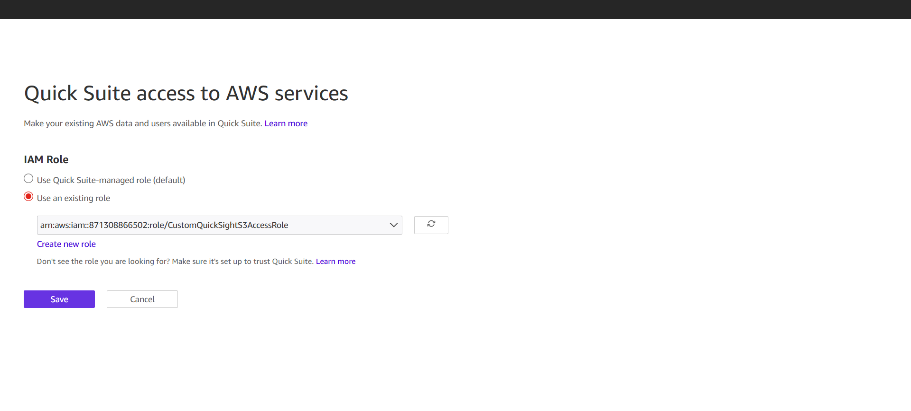
  </li>
</ul>

<a href="#readme-top">↑ Back to Top</a>

<h2 id="gitops">GitOps & CI/CD Workflow</h2>

This project uses a fully automated GitOps pipeline to ensure code quality and deployment reliability. The <strong>Pre-commit</strong> framework implements a "Shift-Left" strategy, ensuring that code is formatted, documented, and secure before it ever leaves your machine.

<h3>Workflow</h3>
<ol>
  <li>
    <strong>Branch Protection Rulesets</strong> 
    To ensure high code quality and prevent unauthorized changes to the production environment, the <code>main</code> branch is governed by a <strong>GitHub Branch Ruleset</strong>.
    <ul>
      <li><strong>Pull Request Mandatory:</strong> No code can be pushed directly to <code>main</code>. All changes must originate from a feature branch and be merged via a Pull Request.</li>
      <li><strong>Required Status Checks:</strong> The <code>Infrastructure CI</code> (Terraform Plan & Static Analysis) must pass successfully before a merge is permitted.</li>
      <li><strong>Bypass Authority:</strong> The dedicated GitHub App is added to the Bypass List with "Always allow" permissions. This allows the bot to push documentation updates directly to <code>main</code> without being blocked by PR requirements.</li>
    </ul>
  </li>
  <li>
    <strong>Pre-commit</strong>
    <ul>
      <li><strong>Tool:</strong> Executes <code>terraform fmt</code>, <code>terraform validate</code>, <code>TFLint</code>, <code>terraform_docs</code> and <code>checkov</code> to ensure the code is clean.</li>
      <li><strong>Trigger:</strong> Runs on every <strong>git commit</strong>.</li>
      <li>
        <strong>Outcome:</strong> If any check fails, the commit is blocked. You fix the error, re-add the file, and commit again.
      </li>
    </ul>
  </li>
  <li>
    <strong>Continuous Integration (PR)</strong>
    <ul>
      <li><strong>Tool:</strong> Executes <code>terraform fmt -check</code>, <code>terraform validate</code> and <code>checkov</code>, then do <code>plan</code> and cost estimation and print it on PR.</li>
      <li><strong>Trigger:</strong> Runs on every <strong>Pull Request</strong>.</li>
      <li>
        <strong>Outcome:</strong> This acts as the "Gatekeeper" before code is merged to <code>main</code>.
      </li>
    </ul>
  </li>
  <li>
    <strong>Continuous Delivery (Deployment)</strong>
    <ul>
      <li><strong>Tool:</strong> Terraform Cloud + GitHub Actions OIDC.</li>
      <li><strong>Trigger:</strong> Merges to the <code>main</code> branch.</li>
      <li>
        <strong>Outcome:</strong> The pipeline verifies the infrastructure state and runs a post-deployment health check.
      </li>
    </ul>
  </li>
  <li>
    <strong>Dynamically update readme documentation</strong>
    <ul>
      <li><strong>Tool:</strong> <code>terraform_docs</code> + GitHub Actions.</li>
      <li><strong>Trigger:</strong> Merges to the <code>main</code> branch.</li>
      <li>
        <strong>Outcome:</strong> The pipeline verifies the infrastructure state from Terraform Cloud, retrieve outputs from Terraform Cloud and update the readme documentation file dynamically.
      </li>
    </ul>
  </li>
</ol>

<h3>Prerequisites for GitOps</h3>
<ul>
  <li><strong>Repository Secret <code>TF_API_TOKEN</code>:</strong> Required for GitHub to communicate with Terraform Cloud.</li>
  <li><strong>Trigger:</strong> A GitHub Actions OIDC role (<code>GitHubActionRole</code>) allows the runner to verify AWS resources without long-lived keys.</li>
  <li>
      <strong>Automated Documentation via GitHub App:</strong> Instead of using a Personal Access Token (PAT) or the default <code>GITHUB_TOKEN</code>, this project uses a custom <strong>GitHub App</strong> for automated tasks. 
      <table>
         <thead>
            <tr>
               <td>Secret</td>
               <td>Description</td>
               <td>Source</td>
            </tr>
         </thead>
         <tbody>
            <tr>
               <td><code>BOT_APP_ID</code></td>
               <td>The unique numerical ID assigned to your GitHub App.</td>
               <td>App Settings > General</td>
            </tr>
            <tr>
               <td><code>BOT_PRIVATE_KEY</code></td>
               <td>The full content of the generated <code>.pem</code> private key file.</td>
               <td>App Settings > Private keys</td>
            </tr>
         </tbody>
      </table>
   </li>
</ul>

<a href="#readme-top">↑ Back to Top</a>

<h2 id="usage">Usage & Testing</h2>
<h3>🧪 Testing Steps in AWS Console</h2>

Follow these steps to verify your pipeline is working correctly:

<ol>
  <li>
    <strong>Upload to Raw Bucket:</strong>
    <pre>aws s3 cp &lt;your-csv-file&gt; s3://&lt;your-s3-raw-bucket&gt;</pre>
    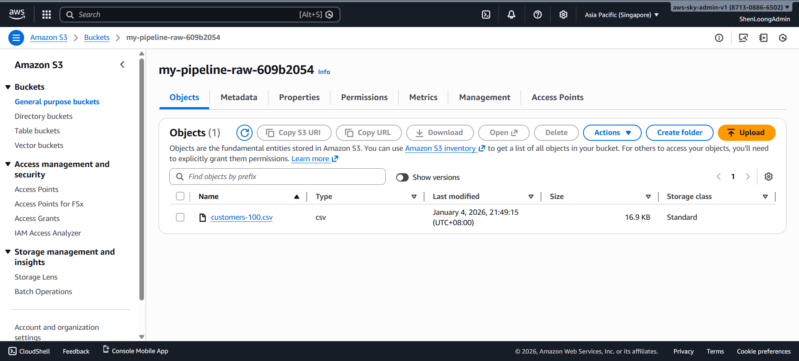
  </li>
  <li>
    <strong>Inspect Lambda Logs:</strong> Go to <strong>CloudWatch > Log Groups</strong> and find <code>/aws/lambda/csv_data_cleaner</code>. Check the latest stream to confirm the file was processed and rows were cleaned. 
    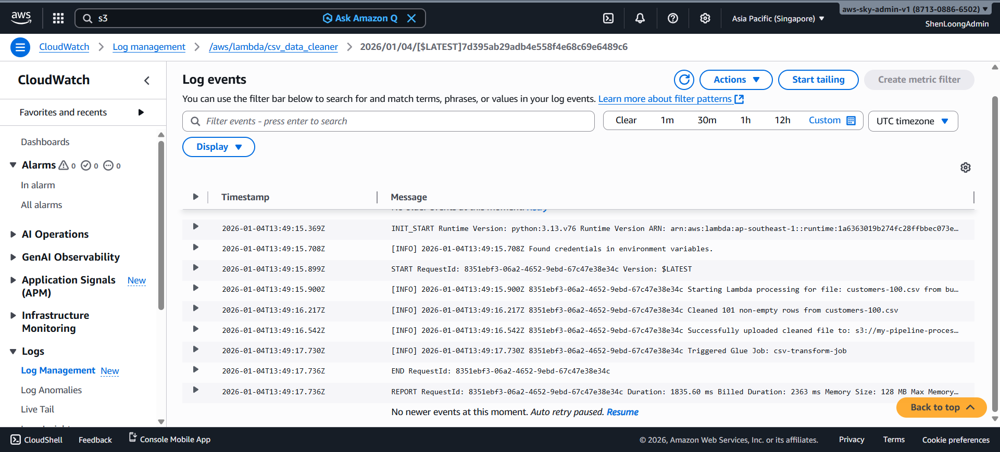
  </li>
  <li>
    <strong>Check ETL Jobs:</strong> Open the <strong>AWS Glue</strong> console. Under ETL jobs, verify that <code>csv-transform-job</code> was automatically triggered by the Lambda function. 
    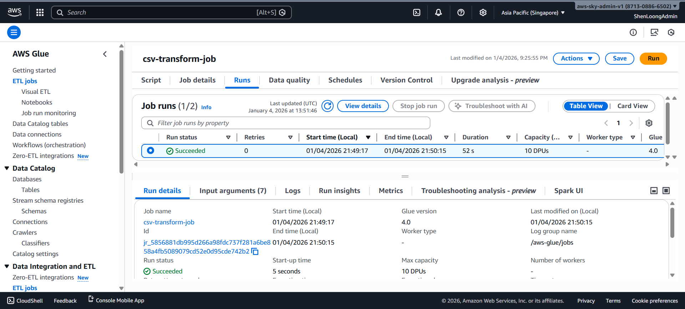
  </li>
  <li>
    <strong>Check Bucket Objects:</strong>
    <ul>
      <li>Confirm a cleaned version exists in the <code>...processed...</code> bucket.</li>
      <li>
        Confirm a csv file generated in the <code>...transformed...</code> bucket. 
        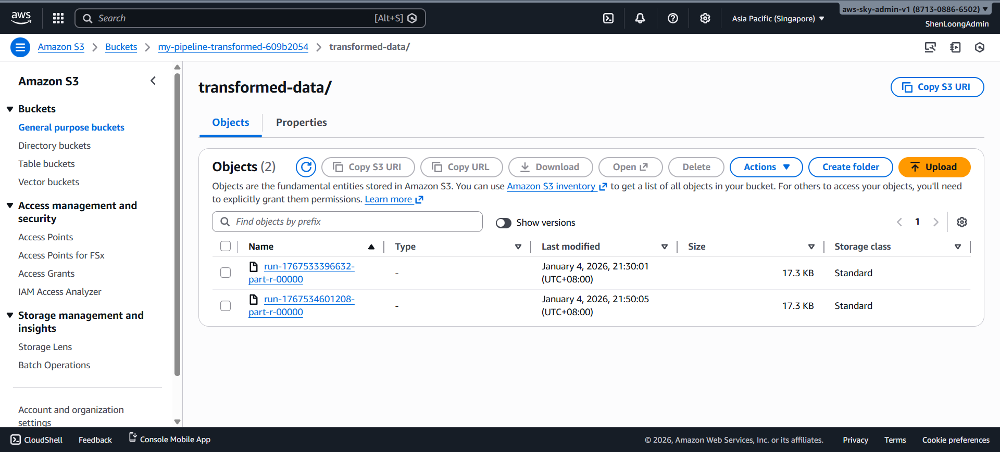
      </li>
    </ul>
  </li>
  <li>
    <strong>Quick Suite Registration:</strong> Open <strong>Amazon QuickSight</strong>. If it's your first time, follow the prompts to sign up for the <strong>Enterprise Edition</strong> and register your notification email. 
    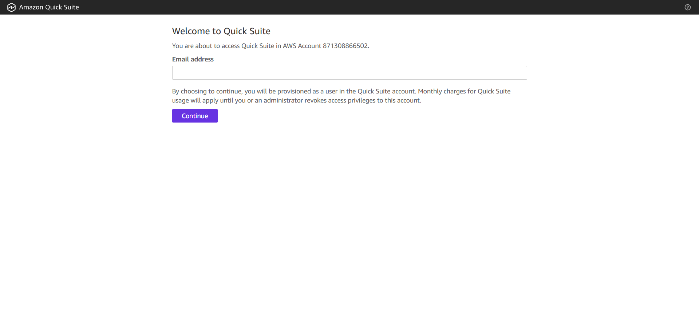
  </li>
  <li>
    <strong>Add Dataset:</strong>
    <ul>
      <li>Click <strong>Datasets > New dataset > S3</strong>.</li>
      <li>
        Enter a name and the <strong>S3 URI</strong> of your <code>manifest.json</code> file found in the transformed bucket. 
        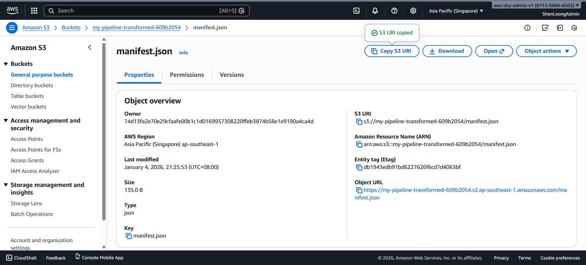 
        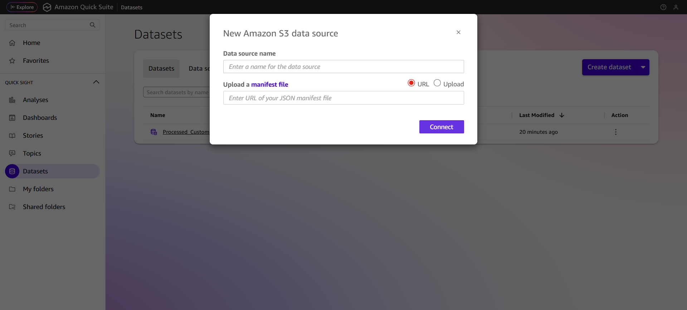
      </li>
    </ul>
  </li>
  <li>
    <strong>Visualize:</strong> Click <strong>Visualize</strong> to create an analysis. Drag fields into the workspace to create charts (e.g., bar charts, pivot tables). 
    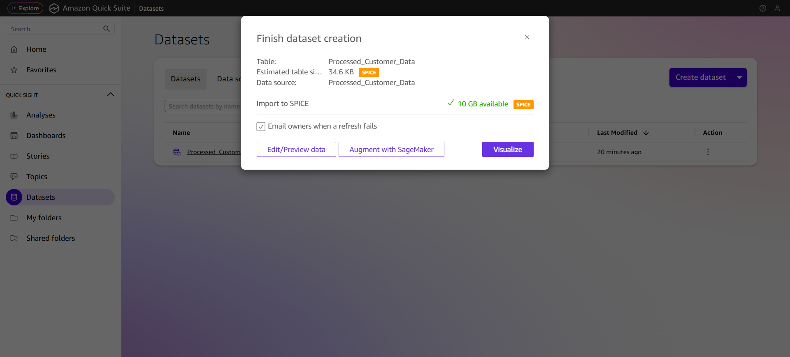
  </li>
  <li>
    <strong>Publish:</strong> Once customized, click <strong>Share > Publish</strong> dashboard to create a read-only version for stakeholders. 
    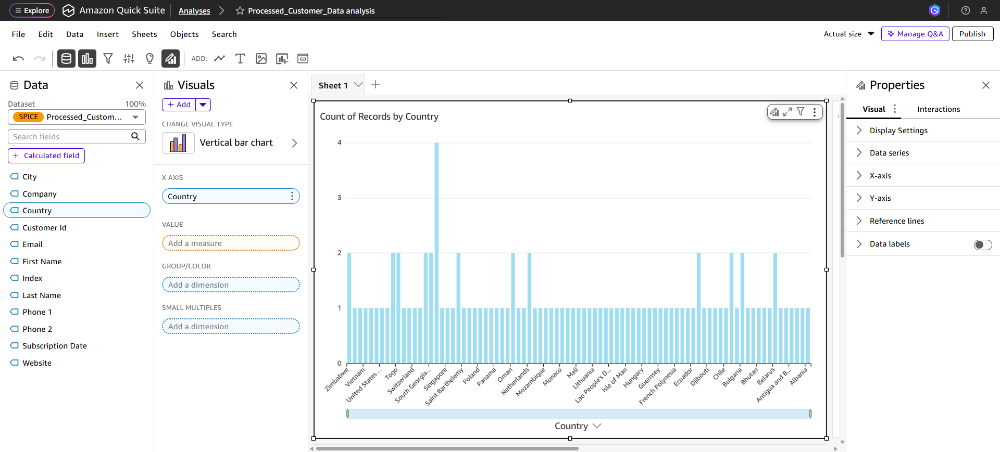 
    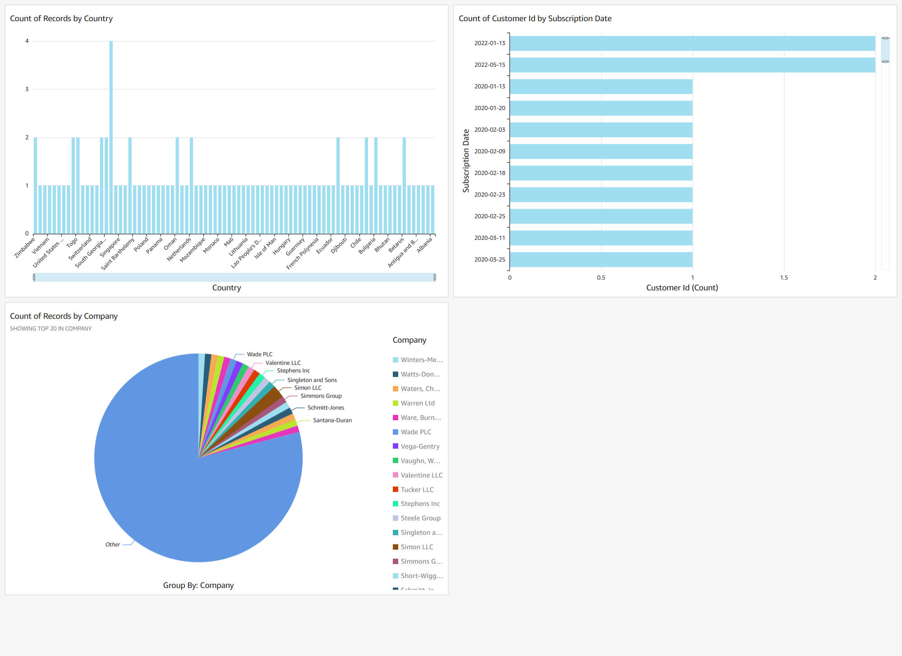
  </li>
  <li>
    <strong>Schedule Refresh (Optional):</strong> In the <strong>Datasets</strong> tab, select your dataset and go to <strong>Refresh</strong>. Click <strong>Add new schedule</strong> to keep your charts updated automatically.
  </li>
</ol>

<a href="#readme-top">↑ Back to Top</a>

<h2 id="roadmap">Roadmap</h2>
<ul>
  <li>[x] <strong>Parquet Migration:</strong> Replaced CSV-only flow with optimized binary storage.</li>
  <li>[x] <strong>IAM Scoping:</strong> Removed wildcards for log groups and S3 paths.</li>
  <li>[x] <strong>Automated Cleaning:</strong> Python Lambda removes empty rows before ETL.</li>
  <li>[x] <strong>Event-Driven:</strong> Fully automated triggers from S3 upload to Glue execution.</li>
  <li>[ ] <strong>Multi-format Support:</strong> Extend the Lambda/Glue logic to handle JSON and Excel files.</li>
  <li>[ ] <strong>Data Validation:</strong> Add Great Expectations or Glue Data Quality to block malformed data from reaching the transformed layer.</li>
  <li>[ ] <strong>Real-time Alerting:</strong> Implement SNS notifications for Glue Job failures.</li>
</ul>

<a href="#readme-top">↑ Back to Top</a>

<h2 id="challenges">Challenges</h2>
<table>
  <thead>
    <tr>
      <th>Challenge</th>
      <th>Solution</th>
    </tr>
  </thead>
  <tbody>
    <tr>
      <td><strong>Glue Log Fragmentation</strong></td>
      <td>Implemented custom Log Groups in Terraform and utilized the Glue Context Logger to centralize <code>stdout</code> and Spark logs.</td>
    </tr>
    <tr>
      <td><strong>Log Visibility</strong></td>
      <td>Mapped standard Python <code>logging</code> and <code>print</code> to specialized CloudWatch Log Groups managed by Terraform.</td>
    </tr>
    <tr>
      <td><strong>Sticky Quick Suite (QuickSight) Deletions</strong></td>
      <td>Managed <code>termination_protection_enabled</code> via Terraform and added explicit <code>depends_on</code> to prevent account deletion locks.</td>
    </tr>
    <tr>
      <td><strong>Permissions</strong></td>
      <td>Implemented Scoped IAM policies (Least Privilege) to ensure Lambda/Glue only access specific buckets.</td>
    </tr>
    <tr>
      <td><strong>Data Format Compatibility</strong></td>
      <td>Switched from S3 Manifests (text-only) to Athena (connector-based) to support high-performance CSV files in Quick Suite.</td>
    </tr>
  </tbody>
</table>

<a href="#readme-top">↑ Back to Top</a>

<h2 id="well-architected">AWS Well-Architected Framework Alignment</h2>

This project is designed according to the six pillars of the <strong>AWS Well-Architected Framework</strong>, ensuring a reliable, secure, and efficient cloud environment.

<ol>
  <li>
    <strong>Operational Excellence</strong>
    
The project excels in this pillar by treating operations as code and automating manual processes.

    <ul>
      <li><strong>Infrastructure as Code (IaC):</strong> The entire pipeline—including S3 buckets, Lambda functions, Glue jobs, and IAM roles—is provisioned using Terraform. This allows for frequent, small, and reversible changes and ensures the environment can be reproduced consistently.</li>
      <li><strong>Observability:</strong> <strong>Amazon CloudWatch</strong> is used for centralized logging of both the Lambda function (<code>/aws/lambda/csv_cleaner</code>) and the Glue ETL job (<code>/aws-glue/jobs/csv-transform-job</code>). This provides insights into system health and allows for rapid troubleshooting.</li>
      <li><strong>Automation:</strong> The pipeline is fully event-driven; uploading a file to the "Raw" S3 bucket automatically triggers the cleaning and transformation process without human intervention.</li>
    </ul>
  </li>
  <li>
    <strong>Security</strong>
    
Security is baked into the project through fine-grained access controls and data protection mechanisms.

    <ul>
      <li><strong>Least Privilege:</strong> Custom IAM roles (like <code>quicksight_custom_role</code> and <code>glue_role</code>) are defined with narrow policies that grant only the necessary permissions to specific S3 buckets.</li>
      <li><strong>Data Protection at Rest:</strong> S3 buckets are configured with <strong>AES256 server-side encryption</strong> by default in the Terraform code</li>
      <li><strong>Public Access Prevention:</strong> Every S3 bucket in the <code>main.tf</code> includes an <code>aws_s3_bucket_public_access_block</code> to ensure data is never inadvertently exposed to the public internet.</li>
      <li><strong>Data Integrity:</strong> <strong>S3 Versioning</strong> is enabled on buckets to protect against accidental deletions or overwrites, providing an easy recovery path.</li>
    </ul>
  </li>
  <li>
    <strong>Reliability</strong>
    
The use of managed serverless services inherently improves the reliability of the system.

    <ul>
      <li><strong>Serverless Foundations:</strong> By using <strong>AWS Lambda</strong> and <strong>AWS Glue</strong>, the architecture offloads infrastructure management to AWS, ensuring high availability and automatic scaling without the need to manage servers.</li>
      <li><strong>Error Handling (DLQ):</strong> The implementation includes an <strong>Amazon SQS Dead Letter Queue (DLQ)</strong> for the Lambda function, which prevents data loss by capturing failed events for later inspection and replay.</li>
      <li><strong>Data Integrity:</strong> <strong>S3 Versioning</strong> is enabled in your <code>main.tf</code>, allowing you to recover original CSV files even if they are accidentally deleted or overwritten during a transform job.</li>
    </ul>
  </li>
  <li>
    <strong>Performance Efficiency</strong>
    
The architecture utilizes "mechanical sympathy" by selecting services optimized for their specific tasks.

    <ul>
      <li><strong>Mechanical Sympathy:</strong> Although not using Parquet, I achieve performance efficiency by using <strong>AWS Glue (Spark)</strong> for data heavy-lifting. Spark is naturally efficient at processing CSV data in parallel across multiple worker nodes.</li>
      <li><strong>Elastic Scaling:</strong> Both Lambda and Glue scale automatically based on the volume of incoming data, ensuring performance remains consistent whether processing a single small file or a massive batch</li>
      <li><strong>Event-Driven Triggering:</strong> Resources are only active when data is present, ensuring that your compute resources (Lambda and Glue) are used exactly when needed and not a second longer</li>
    </ul>
  </li>
  <li>
    <strong>Cost Optimization</strong>
    
The project minimizes costs by adopting a "pay-for-what-you-use" model and managing the data lifecycle.

    <ul>
      <li><strong>Worker Capping:</strong> Glue Jobs are limited to <code>G.1X</code> worker types and 2 workers max.</li>
      <li><strong>Serverless Execution:</strong> You only pay for the seconds your Lambda and Glue jobs run; there are no idle server costs.</li>
      <li><strong>QuickSight SPICE:</strong> Utilizing SPICE (Super-fast, Parallel, In-memory Calculation Engine) allows for fast dashboard performance without hitting S3 for every visual interaction.</li>
      <li><strong>Development Safety:</strong> <code>max_retries = 0</code> ensures failed Spark jobs don't burn credits through automatic restarts.</li>
      <li><strong>Consumption Model:</strong> Only pay for the seconds that your Lambda function and Glue jobs are running. There are no idle costs for "always-on" servers.</li>
      <li><strong>Managed Lifecycle Policies:</strong> Terraform code includes <strong>S3 Lifecycle Rules</strong> that delete data after 30 days and delete incomplete uploads to save on storage costs.</li>
      <li><strong>Managed Services:</strong> Utilizing managed services like QuickSight and Glue reduces the operational overhead and "hidden costs" of managing your own BI and ETL infrastructure.</li>
      <li><strong>Note on QuickSight:</strong> This project is <strong>not fully in the free tier</strong> due to the Enterprise Edition subscription. Estimated cost: <strong>$0.50 - $1.00 USD</strong> if cleaned up immediately after testing.</li>
    </ul>
  </li>
  <li>
    <strong>Sustainability</strong>
    
Sustainability focuses on minimizing the environmental impact of your workloads.

    <ul>
      <li><strong>Shared Responsibility:</strong> By opting for a fully serverless architecture, you maximize the utilization of AWS's underlying hardware, which reduces the total energy required per unit of work compared to running underutilized EC2 instances.</li>
    </ul>
  </li>
</ol>

<a href="#readme-top">↑ Back to Top</a>

<h2 id="cost-optimization">⚠️ Important: Cleanup </h2>

Before running terraform destroy, verify these settings manually in the AWS Console to avoid errors:

<ul>
  <li>
    <strong>Termination Protection:</strong> While the code sets <code>termination_protection_enabled = false</code>, manually verify this by going to <strong>QuickSight > Manage QuickSight > Account Settings</strong>. Ensure the toggle is <strong>Disabled</strong>.
  </li>
</ul>

<a href="#readme-top">↑ Back to Top</a>

<h2 id="acknowledgements">Acknowledgements</h2>

  Special thanks to <strong>Tech with Lucy</strong> for the architectural inspiration and excellent AWS tutorials that helped shape this pipeline.

<ul>
  <li>
    See her youtube channel here: <a href="https://www.youtube.com/@TechwithLucy" target="_blank">Tech With Lucy</a>
  </li>
  <li>
    Watch her video here: <a href="https://www.youtube.com/watch?v=0hJxcBdRlYw" target="_blank">5 Intermediate AWS Cloud Projects To Get You Hired (2025)</a>
  </li>
</ul>

<a href="#readme-top">↑ Back to Top</a>

<h2 id="acknowledgements">Acknowledgements</h2>

  Special thanks to <strong>Tech with Lucy</strong> for the architectural inspiration and excellent AWS tutorials that helped shape this pipeline.

<ul>
  <li>
    See her youtube channel here: <a href="https://www.youtube.com/@TechwithLucy" target="_blank">Tech With Lucy</a>
  </li>
  <li>
    Watch her video here: <a href="https://www.youtube.com/watch?v=hiE0El3zs1Y" target="_blank">5 Beginner AWS Cloud Projects To Get You Hired (2025)</a>
  </li>
</ul>

<a href="#readme-top">↑ Back to Top</a>

[contributors-shield]: https://img.shields.io/github/contributors/{{GITHUB_USER}}/{{REPO_NAME}}.svg?style=for-the-badge
[contributors-url]: {{REPO_URL}}/graphs/contributors

[forks-shield]: https://img.shields.io/github/forks/{{GITHUB_USER}}/{{REPO_NAME}}.svg?style=for-the-badge
[forks-url]: {{REPO_URL}}/network/members

[stars-shield]: https://img.shields.io/github/stars/{{GITHUB_USER}}/{{REPO_NAME}}.svg?style=for-the-badge
[stars-url]: {{REPO_URL}}/stargazers

[issues-shield]: https://img.shields.io/github/issues/{{GITHUB_USER}}/{{REPO_NAME}}.svg?style=for-the-badge
[issues-url]: {{REPO_URL}}/issues

[license-shield]: https://img.shields.io/github/license/{{GITHUB_USER}}/{{REPO_NAME}}.svg?style=for-the-badge
[license-url]: {{REPO_URL}}/blob/master/LICENSE.txt

[linkedin-shield]: https://img.shields.io/badge/-LinkedIn-black.svg?style=for-the-badge&logo=linkedin&colorB=555
[linkedin-url]: {{LINKEDIN_URL}}

[ci-shield]: https://github.com/{{GITHUB_USER}}/{{REPO_NAME}}/actions/workflows/ci.yml/badge.svg
[ci-url]: https://github.com/{{GITHUB_USER}}/{{REPO_NAME}}/actions/workflows/ci.yml

[cd-shield]: https://github.com/{{GITHUB_USER}}/{{REPO_NAME}}/actions/workflows/cd.yml/badge.svg
[cd-url]: https://github.com/{{GITHUB_USER}}/{{REPO_NAME}}/actions/workflows/cd.yml

[docs-shield]: https://github.com/{{GITHUB_USER}}/{{REPO_NAME}}/actions/workflows/documentation.yml/badge.svg
[docs-url]: https://github.com/{{GITHUB_USER}}/{{REPO_NAME}}/actions/workflows/documentation.yml
